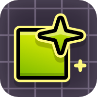

#  NinKaz's Immersive Editor

A modern level editor for the modern creator.

This mod is available on the [Geode index](https://geode-sdk.org/mods/ninkaz.immersive_editor) for Windows, Mac, Android, and iOS. After installing Geode, search for it in the in-game mod browser and click install.

## Features

This mod features many quality-of-life tweaks, visual polish, and long-overdue bugfixes:

### Object Effects

- Object glow/particles
- Pulsing objects
- Portal backsides
- Colorblind indicators

### Level Effects

- Fade/enter effects
- Gravity switch effects
- Player effects (particles, trails)

### Playtest

- Activate shake, show/hide ground, BG effect, and ghost effect triggers
- Hide triggers/duration lines while playtesting
- Automatically hide playtest buttons when not in use

### Selection

- Improve selection hitboxes
- Preview to-be-selected objects

### Bugfixes

- Object rotations no longer drift after saving/re-entering the editor
- Follow trigger miscalculations no longer cause massive, laggy memory allocations
- Shader/camera triggers work properly from start positions

## API

The `SelectionBox` class is a helper class that implements the better selection hitboxes logic. It should be used when creating custom selection logic.

```cpp
#include <ninkaz.immersive_editor/include/Selection.hpp>

ie::SelectionBox box = ie::SelectionBox::fromObject(m_editorLayer, object, false);
bool intersects = box.intersectsRect(rect);

ie::SelectionBox other = ie::SelectionBox::fromRotatedRect(rect, pivot, rotation);
bool intersectsOther = box.intersectsBox(other);
```

The `setPreviewColor` function should be used when reimplementing the default selection box.

## Build instructions

This mod can be built just like any other Geode mod. For more information, see the [geode docs](https://docs.geode-sdk.org/getting-started/cpp-stuff/).

```sh
# Assuming you have the Geode CLI set up already
geode build
```

Some Geode-specific macros don't compile on MSVC. If you're having issues, try using Clang.
